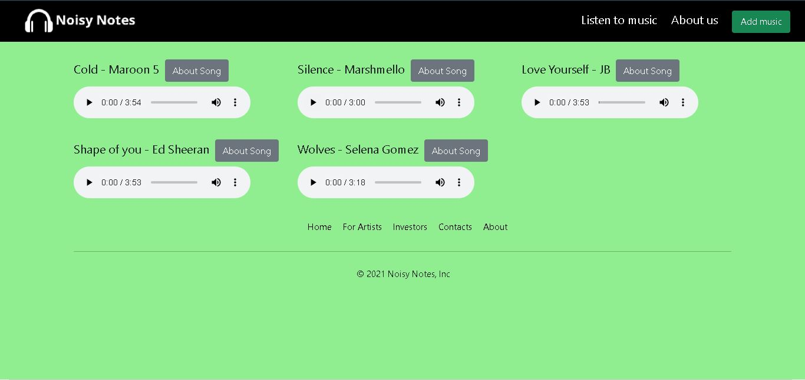
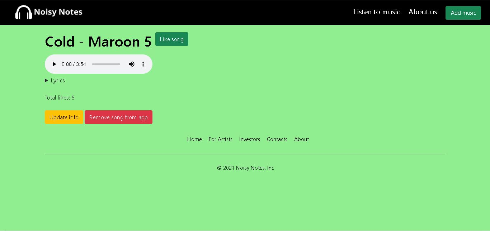
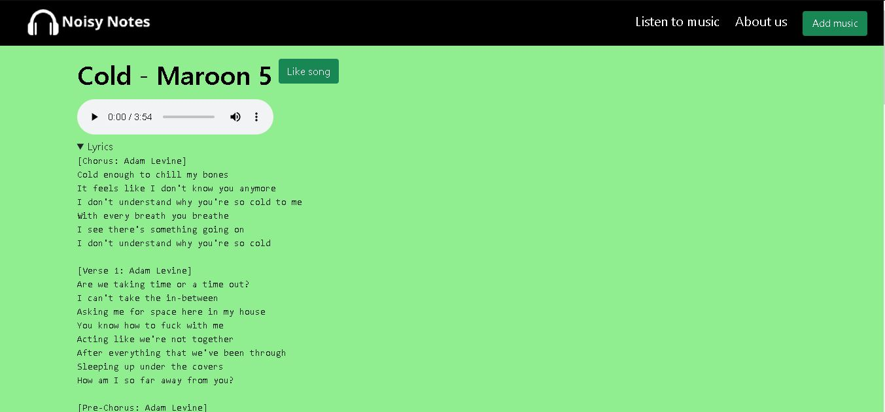
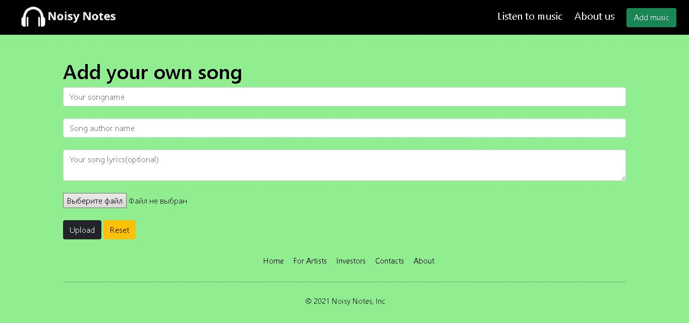
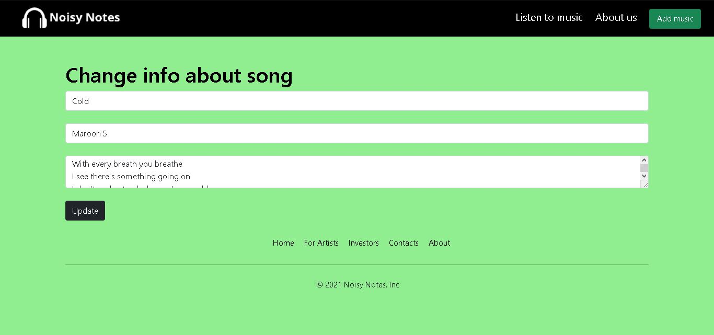

# Noisy Notes
### Flask example application. Version 1.0.0
#### Characteristics:
* Python 3.10;
* Flask 2.0.2;
* Database type - SQLite.

### Home page: 
 
#### Abilities:
* Listen to music;
* Add song;
* Get info about song. 
### About song page: 
 
### About song page(includes lyrics): 
 
#### Abilities:
* Listen to music;
* Change song info;
* Like song;
* Delete song. 
### Add song page: 
 
#### Abilities:
* Add song. 
### Update song page: 
 
#### Abilities:
* Update song info. 
### About us page: 
 
