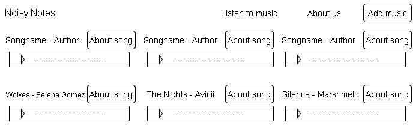
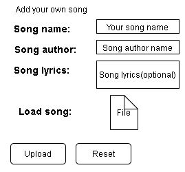
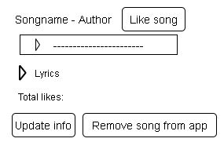
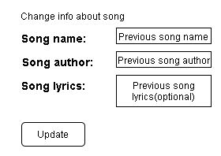

#Music player
##Vision 
"Music player" is web-application which allows users to upload and listen to the music. 
Application should provide:
* Storing music, authors and lyrics in database
* Display songs to listen
* Displays song likes
* Add song to the app
* Update information about song
* Delete song from the app
* Like song

##1. Main page
###1.1 Display all available songs
The mode is designed to view all songs available at the moment. 
**Main scenario:** 
* User select item "Listen to music";
* Application displays list of songs. 

  
Pic. 1.1 View the songs list. 
The list displays the following columns: 
* Song name - name of the song;
* Song author - author of the song; 
###1.2 Add song 
**Main scenario:** 
* User clicks the "Add music" button;
* Application displays form to add song;
* User enters data abd presses "Upload" button;
* If any data is entered incorrectly, the song won't be added;
* If entered data is valid, then record is adding to database;
* If new song id successfully added, then list of songs with added song is displaying;
* To reset all entered information in the form user can press "Reset" button.

 
Pic 1.2 Add song.  
When adding a song, the following details are entered:  
* Song name - name of the song;
* Song author - author of the song;
* Song lyrics - lyrics of the song;
* Song file - audio file.

###1.3 About song
**Main scenario:** 
* User clicks the "About song" button in the song list view;
* Application displays extended information about song included song lyrics;

 
Pic 1.3 About song.  
Info list displays the following columns: 
* Song name - name of the song;
* Song author - author of the song;
* Song lyrics - lyrics of the song;
* Total likes - number of likes.  

###1.4 Edit song
**Main scenario:** 
* User clicks the "Update info" button in the song's info view;
* Application displays form to enter song data;
* User enters song data and presses "Update" button;
* If any data is entered incorrectly, the song won't be updated;
* If entered data is valid, then edited data is added to database;
* If song is successfully edited, then list of songs with added records is displaying.

 
Pic. 1.4 Edit song. 
When editing a song, the following details are entered:
* Song name - name of the song;
* Author - author of the song;

###1.5 Removing the song
**Main scenario:** 
* The user, while in the song's info, presses the "Remove song from app" button in the selected order line;
* Record is deleted from database;
* If order record is successfully deleted, then list of songs without deleted records is displaying.

###1.6 Like the song
**Main scenario:** 
* User clicks the "Like" button in the song's info view;
* Current song's likes counter increments itself;
* If song is successfully liked, then list of songs with liked records is displaying.

##2. About us
**Main scenario:** 
* User clicks the "About us" button;
* Application displays page about web application;

